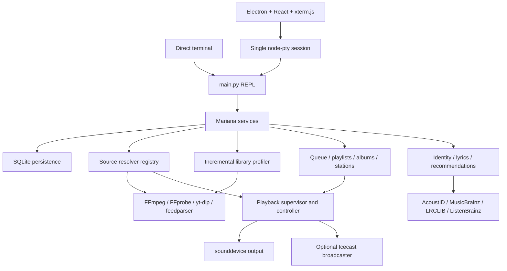

> This document describes the intended software architecture independent of any specific release.
> Architectural changes should be reflected here when they intentionally alter subsystem responsibilities or invariants.

# Mariana architecture state

## Document purpose

This document describes Mariana's implemented software architecture and design
constraints independently of a particular release result. Current versions,
release artifacts, executed verification, and pending release gates are recorded
in [PROJECT_STATE.md](PROJECT_STATE.md).

## Architectural overview

Mariana uses one command surface with two hosts:

- A direct terminal runs the Python REPL in `main.py`.
- Electron starts that same backend in one native PTY and renders it through
  React and xterm.js.

The backend is a local-first service composition. Canonical media references
flow through source resolvers into supervised FFmpeg decoder sessions. PCM is
processed by ordered gain/mix stages, optionally tapped for broadcasting, and
sent to the selected output through `sounddevice`. Versioned SQLite persistence
holds durable media and application state. Platform-specific paths, process
ownership, output devices, credentials, and file operations are isolated behind
focused adapters.

## Subsystem boundaries

| Subsystem | Boundary and ownership |
|---|---|
| Command host | `main.py` owns parsing, prompts, compatibility aliases, and service orchestration |
| Desktop host | `desktop/` owns the window, PTY, renderer, secure IPC, structured state display, and update coordination |
| Shared contracts | `mariana/models.py` owns serializable media, capability, playback, queue, station, album, and download models |
| Persistence | `mariana/database.py` owns the SQLite connection, schema, transactions, backups, and migration |
| Source resolution | `mariana/sources.py` and source-specific adapters own canonical-to-transient resolution and failure classification |
| Playback | `mariana/playback.py` owns decoder sessions, PCM buffers, gain/mix stages, snapshots, output streams, and process cleanup |
| Supervision | `mariana/supervisor.py` owns retries, re-resolution, endpoint failover, output recovery, and cancellation |
| Library | `mariana/library.py` and `mariana/library_service.py` own roots, occurrences, staged profiling, watchers, workers, and tombstones |
| Queue and collections | `mariana/queueing.py`, `playlists.py`, `albums.py`, `download_jobs.py`, and `station.py` own persistent playback intent |
| Identity and lyrics | `mariana/identity.py` and `lyrics_provider/` own fingerprints, external identity, lyric resolution, caching, and display |
| Loudness | `mariana/loudness.py` owns ReplayGain metadata, analysis, persistence, and gain selection |
| Radio and broadcast | `mariana/radio.py` and `mariana/broadcast.py` own station catalogs, health, ICY state, live recovery, and Icecast transmission |
| Recommendations | `recommendation_engine/` owns feature extraction, preference learning, ranking, explanations, and optional candidate sources |
| Runtime and setup | `mariana/paths.py`, `setup.py`, `tool_setup.py`, and `toolchain.py` own writable state, first-run transactions, and managed tools |
| Platform security | `mariana/platform.py`, `output_devices.py`, `credentials.py`, `tls.py`, and `media_removal.py` isolate host-specific operations |

## Host architecture

### CLI host

`main.py` is the authoritative REPL and compatibility boundary. It initializes
runtime paths, settings, persistence, playback, library, queue, download,
station, recommendation, and desktop-control services. The command loop remains
intentionally compatible with historical syntax.

Modern features should expose service APIs under `mariana/` and leave `main.py`
as orchestration and presentation. The large REPL is not a suitable location
for new persistence, networking, or media engines.

### Electron host

`desktop/main.ts` owns exactly one backend PTY. Tabs are terminal views over
that PTY and share audio, queue, and database state. The host retains a bounded
ANSI stream for new views and resets retained output on full terminal-clear
sequences.

Renderer isolation rules:

- Local packaged content only.
- Context isolation enabled.
- Renderer sandbox enabled.
- Node integration disabled.
- Restrictive content security policy.
- Validated IPC senders.
- Narrow typed preload methods.

UI controls issue ordinary CLI commands. The authenticated structured side
channel reports events such as playback, station, sleep, broadcast, update
safety, and fatal errors; it does not provide a second command path.

## Runtime dependency graph



Dependency direction is toward shared contracts and persistence. Platform and
external adapters must not own application playback or queue state.

## Media-reference and source architecture

`MediaRef` is the stable application reference. It contains source type,
original canonical URI, metadata, capabilities, resolver hints, provenance, and
optional chapters. Its stable ID is derived from the source type and canonical
URI unless explicitly retained from indexed identity.

`ResolvedMedia` represents an execution-time result. It may contain a transient
playback URI, headers, expiry, endpoint alternatives, metadata, and verified
capabilities. Transient signed URLs and authorization data are never durable.

`SourceResolver` implementations provide:

- Resolution.
- Refresh/re-resolution.
- Capability probing.
- Typed failure classification.

Supported durable protocols are `file`, `http`, and `https`. HLS/DASH,
Icecast/Shoutcast, YouTube, podcasts, and catalog radio are higher-level adapters
over those transports. Recommendations are candidate sources, not transports;
recommended items are resolved through their actual underlying source.

## Playback architecture

### State and ownership

The playback controller exposes these states:

- `IDLE`
- `RESOLVING`
- `BUFFERING`
- `PLAYING`
- `PAUSED`
- `SEEKING`
- `CROSSFADING`
- `FAILED`
- `STOPPING`

`PlaybackController` owns the active decoder, prefetched decoder, bounded PCM,
sample-derived position, gain stages, output stream, snapshot, and process
lifetime. `PlaybackSupervisor` owns recovery decisions and never duplicates the
controller's playback state.

### Program-audio flow


Key behaviors:

- Position advances from emitted samples rather than subprocess timestamps.
- Pause suspends PCM consumption and bounded backpressure limits decode growth.
- Finite verified-seekable media seeks by restarting FFmpeg with `-ss`.
- Live media rejects seek and can resynchronize at the live edge.
- Crossfade mixes bounded decoder buffers without transferring playback
  ownership.
- User stop, next, exit, and cancellation terminate resolution, retry, decoder,
  and helper work.
- Windows uses Job Objects; POSIX uses process groups for child ownership.
- FFplay is an external diagnostic/video fallback, not the audio state engine.

### Output-device boundary

The output monitor obtains current OS endpoint identity rather than relying on a
cached PortAudio label. On Windows, Core Audio provides the endpoint ID and
friendly name; the adapter maps that endpoint to a WASAPI route and can fall
back to the system mapper during Bluetooth enumeration lag. A bounded output
stream replacement preserves the decoder and queue item.

## Queue and collection architecture

### Queue tree

The persistent queue consists of media nodes and nested groups, with a maximum
depth of eight. Referential validation rejects cycles and orphan nodes. Album
and playlist groups are atomic by default, so root strategies move them as
blocks while preserving internal order.

Queue strategies compile the hierarchy into one upcoming playback order:

- Sequential depth-first order.
- Reproducible seeded shuffle.
- Stable priority.
- Deterministic artist-fair round robin.
- Bayesian/MMR smart ranking.
- Explicit custom order.

Strategies do not restart or move the active item. Structural mutations,
policies, and cursor changes record undo snapshots. Only one queue item is
authoritative for current playback.

The initial queue is a projection of available library occurrences. It follows
library scans until an explicit mutation marks it custom. `queue reset` is the
explicit transition back to library projection.

### Playlists and albums

Playlists are versioned snapshots of the validated queue-tree format. Imports
copy M3U/M3U8 or explicitly requested YouTube playlist state; remote playlists
are never mutated.

Albums model release-specific editions and ordered disc/track positions. Local
release and recording identities are preferred. MusicBrainz release metadata
can fill the catalog, followed by conservative known-media matching and verified
canonical YouTube fallback. Ambiguous editions and unresolved tracks remain
explicit states.

### Downloads

Track and album downloads are persistent jobs with ordered child items.
Execution is bounded and sequential, with progress, pause, resume, cancellation,
and restart recovery. Output activation is atomic. Album expansion is explicit;
a plain audio download targets one current track.

### Track-seeded stations

Station sessions snapshot the prior queue, generate immediate local/history
candidates, and optionally add ListenBrainz/MusicBrainz/YouTube candidates.
They maintain a validated ready-ahead window and persist active sessions in a
paused state across restart. One cancellable generation worker belongs to each
session; stale workers must finish or cancel before database shutdown.

## Library architecture

`lib.lib` is the human-editable root list. Parsed roots are normalized,
case-folded, deduplicated, and classified without following directory symlinks
or junctions.

The profiler is a staged, resumable pipeline:

```text
discover
  -> compare file identity, size, and nanosecond mtime
  -> FFprobe and Mutagen metadata
  -> Chromaprint fingerprint
  -> ReplayGain loudness analysis
  -> recommendation features
  -> optional AcoustID/MusicBrainz/LRCLIB enrichment
```

Unchanged occurrences skip deep stages. File IDs and bounded content signatures
preserve identity across renames and allow duplicate content to share derived
analysis while remaining separate occurrences.

Persistent jobs use leases, retries, priorities, and stage-specific errors.
Watchdog provides local filesystem events. Periodic reconciliation handles
missed events, while removable/network roots use bounded polling and backoff.
Deep stages pause while playback is busy. Missing files become tombstones and
are retained until explicit cleanup.

## Identity, lyrics, and recommendation architecture

### Identification and lyrics

Chromaprint/fpcalc is the sole acoustic fingerprint engine. AcoustID maps a
fingerprint to recording candidates, MusicBrainz enriches recording/work/artist
metadata, and LRCLIB supplies lyric text.

Identification is conservative:

- Minimum AcoustID score: `0.85`.
- Minimum runner-up margin: `0.05`.
- Maximum known-duration disagreement: five seconds.

Ambiguous, insufficient, unavailable, offline, no-match, and no-lyrics are
first-class statuses. Embedded lyrics and adjacent `.lrc` files precede LRCLIB.
MusicBrainz requests are rate-limited and cached.

### Recommendations

The core recommendation engine is on-device and combines stable metadata
features with an online Bayesian preference ranker. Thompson exploration,
MMR diversity, recent session context, explicit negative feedback, and an
artist-window limit affect ranking. Results retain human-readable reasons.

Interaction events and features are persisted separately from model artifacts.
Retraining creates a new model atomically and changes the champion marker only
inside a transaction. The optional LAION-CLAP encoder is lazy and cannot become
a core playback dependency. ListenBrainz is opt-in.

Research challengers remain isolated from runtime promotion. Promotion requires
an NDCG@10 improvement without exceeding the accepted diversity regression.

## Loudness and broadcast architecture

ReplayGain profiles can originate from standard tags, Opus R128 tags, or
scan-only rsgain analysis. Profiles are stored in SQLite and keyed by stable
media/content/album identity. Track, album, and queue-aware auto modes select
gain before program mixing. Clipping prevention suppresses unsafe positive gain
when peak data is absent.

Live leveling is distinct from ReplayGain and applies only to live media. It is
explicitly enabled and restarts a live decoder at the live edge when toggled.

The broadcast tap receives normalized program audio before local-only volume,
mute, fade, and sleep automation. A bounded ring drops stale frames rather than
blocking playback. The Icecast encoder and authenticated transport tunnel are
supervised independently. The tunnel retrieves credentials from the OS keyring
and injects authorization upstream, keeping secrets out of FFmpeg arguments.

## Persistent storage architecture

### Runtime path separation

`RuntimePaths` separates immutable resources from writable state. Electron
passes explicit resource/data locations; direct launches use platform-standard
data directories. Tests can inject isolated paths before services initialize.

Legacy source-tree state is copied atomically and hash-verified without deleting
the source. A migration marker records copied state. Existing installations are
recognized so the first-run wizard is not reintroduced during upgrade.

### SQLite schema

The schema contains:

- Media references and chapters.
- Flat queue items plus hierarchical queue groups and state.
- Queue history and named/versioned playlist snapshots.
- Albums and search-result snapshots.
- Download jobs and items.
- Track identities and lyrics cache.
- Loudness profiles.
- Radio catalog and health.
- Preferences and interaction events.
- Recommendation features and model versions.
- Application state.
- Library roots, occurrences, scan runs, and leased jobs.
- Station sessions and generated items.

Schema upgrades create a verified database backup before migration. Migration
failure closes the connection, removes WAL sidecars, and restores the backup.
State mutations use `BEGIN IMMEDIATE` transactions under a process-local lock.

### First-run state

Setup is a separate JSON state machine rather than a mutable settings flag. Its
atomic file records pending, in-progress, complete, or failed status. A
PID/creation-time lock prevents concurrent setup and permits stale-lock
recovery. Each setup step is idempotent; setup completion is authoritative for
the selected data directory.

## External integration boundaries

| Service/tool | Architectural boundary |
|---|---|
| FFmpeg suite | Child processes for probe/decode/encode; supervised and process-owned |
| yt-dlp | YouTube canonical metadata and transient URL resolution |
| feedparser | Normalized podcast feed/episode parsing |
| Chromaprint | Acoustic fingerprint generation only |
| AcoustID | Conservative fingerprint candidate lookup |
| MusicBrainz | Rate-limited metadata and album release enrichment |
| LRCLIB | Exact/search lyric lookup after local lyrics |
| ListenBrainz | Optional recommendation/station candidates |
| Radio Browser | Station search/import, not playback ownership |
| Icecast | HTTP radio source and optional authenticated broadcast target |
| OS keyring | Credential storage; references only in settings |
| Send2Trash | Native trash operation across a journaled filesystem/database boundary |

All HTTP integrations require bounded timeouts, status validation, sanitized
diagnostics, and typed external-failure behavior.

## Configuration architecture

Factory YAML defaults are recursively merged into writable user settings.
Missing keys are added; existing user values are preserved. System-level
packaged defaults remain in TOML. Human-authored library roots remain in
`lib.lib`.

Configuration domains include:

- Display and appearance.
- Downloads and managed download root.
- Media-tool overrides.
- Playback/autoplay/crossfade/buffer.
- ReplayGain and live leveling.
- Library profiling/watchers.
- Allowed source protocols and YouTube browser profile.
- AcoustID identification.
- Radio and broadcast profiles.
- Recommendation exploration/diversity and optional ListenBrainz token.
- Lyrics-window appearance.

Secrets are stored in the OS keyring or referenced environment variables, not
in the YAML configuration.

## Extension points

- Add a source type by implementing the resolver contract, capability probing,
  refresh behavior, and typed failure mapping.
- Add a library stage by defining persistent job scheduling, leasing, idempotent
  output, retry behavior, and playback-priority rules.
- Add a queue strategy by compiling only upcoming nodes while preserving group
  atomicity, cursor stability, deterministic behavior, and undo state.
- Add an external metadata source behind an adapter with cache, rate limit,
  timeout, provenance, and explicit unavailable state.
- Add an output platform through endpoint discovery and output-stream recreation
  without moving playback ownership.
- Add recommendation candidates or features without making optional network or
  ML dependencies mandatory for playback.
- Add structured desktop state through the authenticated event channel; command
  execution must continue through the PTY.

## Architectural invariants

- One Mariana backend owns one data directory, queue, database, and audio output.
- Canonical references are durable; transient access material is not.
- Queue and playback have one authoritative active item.
- All unbounded external input is bounded by timeout, buffer, recursion, queue,
  or retry limits.
- User cancellation preempts probing, resolution, retry, decode, station, and
  download work.
- Child processes are owned and terminated on cancellation, failure, and exit.
- Packaged resources are read-only.
- Settings migrations are additive.
- Database migrations are backed up, transactional, and recoverable.
- Setup steps are idempotent and setup completion is per data directory.
- Deep library work yields to playback.
- ReplayGain, broadcast, sleep gain, and user volume occupy distinct gain stages.
- Optional services cannot prevent local playback startup.
- Secrets cannot enter logs, settings, SQLite, events, queue data, crash output,
  or subprocess arguments.
- Media removal has no permanent-delete fallback.
- Ambiguous identity and catalog resolution must remain ambiguous.
- Electron controls cannot create a second command implementation.

## Architectural tradeoffs and rationale

- **Single PTY versus one backend per tab:** one PTY preserves exclusive audio,
  queue, and database ownership. Tabs sacrifice independent sessions in exchange
  for consistent state and process safety.
- **FFmpeg PCM plus sounddevice versus VLC/FFplay control:** direct PCM control
  supports sample-derived progress, gain staging, crossfade, broadcasting, and
  output recovery. It requires explicit buffer and subprocess supervision.
- **Persistent SQLite versus loose YAML/JSON state:** transactions, constraints,
  migrations, leases, and recovery outweigh the additional schema complexity.
  Human-editable roots and settings remain text files where manual editing is
  valuable.
- **Conservative identity versus best-effort guessing:** typed ambiguity protects
  lyrics, recommendations, filenames, and history from false identity.
- **Canonical online references versus cached stream URLs:** re-resolution adds
  latency but prevents persistence of expired URLs and credentials.
- **Incremental profiling versus whole-library rescans:** file identity and staged
  jobs reduce repeated work and permit interruption recovery at the cost of a
  larger persistent job model.
- **Trash journal versus direct deletion:** the native trash/database boundary
  cannot be one OS transaction, so a journal provides recovery while preserving
  non-destructive behavior.
- **Optional ML tier versus mandatory embeddings:** core playback and ranking
  remain lightweight and private; advanced embeddings are separately installed.
- **Legacy REPL compatibility versus immediate rewrite:** stable command behavior
  is preserved while modern services are extracted incrementally.

## Design patterns

- Stable serialized domain models.
- Resolver and adapter registries.
- Supervisor/controller separation.
- Explicit state machines for playback, setup, stations, and downloads.
- Transactional repositories over SQLite.
- Persistent leased background jobs.
- Capability-based command behavior.
- Canonical-reference/transient-resolution separation.
- Ordered gain buses.
- Atomic file replacement and verified activation.
- Journaled cross-boundary operations.
- Compatibility facade around extracted modern services.
- Structured read-only desktop event projection.

## Architecture-relevant migration history

- The original command loop and local-library behavior were retained as the
  compatibility boundary.
- Python 3.12 dependency locks replaced obsolete installer and media stacks.
- yt-dlp replaced pafy, youtube-dl, and direct YouTube HTML scraping.
- feedparser replaced the obsolete podcast parser.
- FFmpeg PCM playback replaced VLC and pygame playback.
- Chromaprint/AcoustID/MusicBrainz/LRCLIB replaced ShazamIO identification and
  related-track persistence.
- SQLite replaced scattered runtime JSON/YAML for queue, library, identity,
  loudness, radio, recommendation, and background-job state.
- The incremental library service replaced the full-rescan metadata subprocess.
- Transactional setup state replaced the mutable source-tree `first_boot` flag.
- The React/Electron PTY host was added without creating a second command API.
- ReplayGain, secure Icecast broadcasting, output-device following, sleep
  automation, hierarchical queues, albums, stations, and persistent downloads
  were added as services around the same playback and persistence boundaries.
- The June 2022 testing snapshot was audited by behavior and assets; obsolete
  runtime implementations and unrelated history were excluded.

## Maintenance constraints

- Avoid broad rewrites of `main.py`; extract behavior behind tested services.
- Do not delete `beta/` adapters without proving their command paths are no
  longer imported.
- Rebuild the PyInstaller backend before Electron packaging after Python changes.
- Update schema version and rollback tests for persistence changes.
- Update command registry, help, tests, and verification matrix together for
  command-surface changes.
- Keep coverage requirements independent: repository branch coverage cannot
  substitute for per-critical-module coverage.
- Preserve fault-injection and package tests for changes involving setup,
  subprocesses, database state, downloads, or Electron lifecycle.
